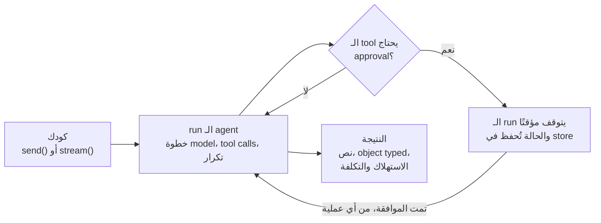

معظم كود الـ agents يبدأ كحلقة تلفّ حول استدعاء model. بعدها يأتي الإنتاج ويطلب أكثر: لازم إنسان يوافق على استرداد المبلغ قبل إرساله. العملية تُعاد تشغيلها والـ run في منتصفه. المحادثة لازم تكمل غدًا من سيرفر آخر. وشخص ما يريد اختبار يفشل لما الـ agent يوقف عن استدعاء الـ tool الصحيح.

`@lousho/build-ai-agent` هي هذه الحلقة وهذه الإجابات مدمجة فيها. مكتبة، لا web framework ولا hosted runtime: حلقة استدعاء tools من نوع typed، مع approvals (موافقات) و sessions (جلسات) و streaming و sub-agents و skills و MCP و CLI. ونفس الـ agent يشتغل في سكربت، أو سيرفر Node، أو حاوية Docker، أو Cloudflare Worker.



```ts
import { createAgent } from '@lousho/build-ai-agent';

const agent = createAgent({ model: 'openai/gpt-4o-mini', instructions: 'You are a helpful assistant.' });
const { text } = await agent.send('Hello!');
console.log(text);
```

## ما يميّزها

<CardGroup cols={3}>
  <Card title="Durable على أي host" icon="database" href="/ar/durable-execution">
    الـ sessions والـ checkpoints وتوقفات الـ approval محفوظة في stores قابلة للتبديل: الذاكرة، ملفات، ملف SQLite واحد، أو Cloudflare KV. والـ run المتوقف مؤقتًا أو المنقطع يستأنف من طلب آخر أو عملية أخرى.
  </Card>
  <Card title="تُختبر مثل الكود" icon="flask-conical" href="/ar/testing">
    `mockModel` يسكربت ردود الـ model، و`recordReplay` يعيد تشغيل runs حقيقية من cassettes دون اتصال، و`defineEval()` يتحقق من الـ tools التي استُدعيت، وبأي ترتيب، وبأي معاملات.
  </Card>
  <Card title="Node و Workers مع tracing" icon="activity" href="/ar/deployment">
    `lousho build` ينشر spec واحد للـ agent على سيرفر Node أو Docker أو Worker. كل run يصدر spans وفق OpenTelemetry GenAI، وكل نتيجة تذكر استهلاك الـ tokens والتكلفة بالدولار الأمريكي.
  </Card>
</CardGroup>

## المكوّنات

كل مكوّن هو دالة واحدة أو خيار واحد على `createAgent()`. استخدم ما تحتاجه؛ لا مكوّن يتطلب غيره.

| المكوّن | ما تكتبه | ما تحصل عليه |
| ----- | -------------- | ------------ |
| [Tools](/ar/tools) | `defineTool()` مع `input` من zod | معاملات typed مع validation، والاستدعاءات تشتغل بالتوازي |
| [Approvals](/ar/approvals) | `needsApproval`، أو قواعد `permissions` | run يتوقف مؤقتًا بانتظار إنسان، ثم يكمل عبر `agent.approvals.resolve()` |
| [Sessions](/ar/sessions) | `agent.session({ id })` | محادثة متعددة الدورات تُحفظ في الذاكرة أو الملفات أو SQLite |
| [الذاكرة](/ar/memory) | خانات `defineMemory()` | حقائق تدخل الـ prompt عبر الـ sessions، لكل مستخدم أو على مستوى عام |
| [المخرجات المنظمة](/ar/structured-output) | `output: zodSchema` | `result.object` typed مع validation، وخطوة إصلاح واحدة |
| [Streaming](/ar/streaming) | `agent.stream()` | أحداث JSON typed وذات إصدارات، جاهزة لـ SSE |
| [Sub-agents](/ar/sub-agents) | `subagents: { researcher, writer }` | أداة `task` واحدة للـ agent الرئيسي؛ والـ sub-agents تشتغل بالتوازي، محليًا أو عن بُعد |
| [Skills](/ar/skills) | `loadSkills()` | تعليمات ما يحمّلها الـ agent إلا لما تحتاجها المهمة |
| [Providers](/ar/providers) | سلسلة بصيغة `provider/model` | OpenAI أو Anthropic أو OpenRouter أو Ollama أو mock، مع retry و fallback |

## أين يعيش الـ agent

الـ agent هو نفس الكائن في كل مكان. اللي يتغير هو الواجهة اللي تقف أمامه.

<CardGroup cols={2}>
  <Card title="في تطبيق ويب" icon="browser" href="/ar/react">
    `useLoushoAgent()` لـ React و Vue، وstore لـ Svelte، و`useChat` من Vercel AI SDK، أو `createRouteHandler(agent)` في أي إطار عمل مبني على Fetch API.
  </Card>
  <Card title="في المحادثات وعلى جدول" icon="message-square" href="/ar/channels">
    قنوات Slack و Discord و webhooks و HTTP العادي تربط الرسائل بالـ sessions وترجّع الـ approvals للقناة. وجدولات cron تبدأ runs من تلقاء نفسها.
  </Card>
  <Card title="في محرّر" icon="code" href="/ar/acp">
    `lousho acp` يقدّم الـ agent عندك إلى Zed وغيره من محررات Agent Client Protocol، مع الـ tool calls وطلبات الصلاحيات.
  </Card>
  <Card title="كخدمة منشورة" icon="rocket" href="/ar/deployment">
    `lousho build` ينتج سيرفر Node أو صورة Docker أو Cloudflare Worker من spec واحد.
  </Card>
</CardGroup>

## مقارنة بمكتبات أخرى

{/* DRAFT for owner review (issue #206): the rows and cell wording below are a
    proposal, not approved copy. Remove the Note and this comment once the
    owner signs off on which rows to keep. */}

<Note>
**مسودة — بانتظار مراجعة المالك.** هذه المقارنة مقترح وليست نصًا معتمدًا. فُحصت الادعاءات مقابل توثيق كل مشروع وقت كتابتها، لكن كل هذه المكتبات تتحرك بسرعة؛ لازم إعادة التحقق من كل خلية قبل نشر هذا القسم.
</Note>

`@lousho/build-ai-agent` يقع في طبقة واحدة فوق استدعاء الـ model: مثل LangGraph أو Mastra أو OpenAI Agents SDK، يشغّل agent loop كامل، لكن كمكتبة لا تفرض منصة ولا web framework ولا hosted runtime — وعلى عكس AI SDK الخام، يأتي معه قطع الإنتاج (durability و approvals و sessions) بدل ما يتركها لك.

| القدرة | `@lousho/build-ai-agent` | Vercel AI SDK | LangChain / LangGraph | Mastra | OpenAI Agents SDK |
| ---------- | ---------------------- | ------------- | --------------------- | ------ | ----------------- |
| Typed event stream | نعم — `agent.stream()` يصدر أحداث JSON ذات إصدارات وأرقام تسلسلية عن الـ runs والخطوات والـ tokens والـ tool calls، جاهزة لـ SSE | جزئي — أجزاء `streamText` typed؛ أما حلقة الـ run فأنت تبنيها | نعم — أحداث الـ node والـ graph عبر `streamEvents` | نعم — streams للـ agent وللـ workflows | نعم — أحداث run مبثوثة |
| Durable execution, checkpoints | نعم — checkpoints في stores قابلة للتبديل (الذاكرة، الملفات، SQLite، Cloudflare KV)؛ والـ run المنقطع أو المتوقف مؤقتًا يستأنف في عملية أخرى | لا — الحالة تبقى في الذاكرة؛ وأنت تحفظها | نعم — الـ checkpointer يحفظ حالة الـ thread | نعم — snapshots لـ suspend/resume في الـ workflows | جزئي — الـ sessions تحفظ السجل؛ أما استئناف الـ run من منتصفه عبر العمليات فغير مدمج |
| Approvals (human-in-the-loop) | نعم — `needsApproval` يوقف الـ run؛ و`agent.approvals.resolve()` يكمله من أي عملية | تبنيها بنفسك — أنت تتحكم في الـ tool call | نعم — `interrupt()` و nodes بشرية | نعم — خطوات بشرية في الـ workflows | جزئي — فيه approvals للأدوات المستضافة؛ أما التحكم في tools عشوائية فيدوي |
| القنوات | نعم — `mountChannels()` يقدّم واجهات HTTP و webhook و Slack و Discord، ويرجّع الـ approvals إلى القناة | لا | لا — adapters مجتمعية فقط | جزئي — بعض تكاملات النشر والدردشة | لا |
| أهداف النشر | `lousho build` ينتج سيرفر Node أو صورة Docker أو Cloudflare Worker من spec واحد | BYO — يشتغل أينما يشتغل تطبيقك | BYO، أو LangGraph Platform (مستضافة) | `mastra build` يستهدف Node و Vercel و Netlify و Workers | BYO — الحلقة تشتغل داخل عمليتك |
| Sessions | نعم — `agent.session({ id })` فوق stores للذاكرة أو الملفات أو SQLite | لا — أنت تحتفظ بمصفوفة الرسائل | نعم — threads ومساعدات لسجل المحادثة | نعم — threads وذاكرة | نعم — كائنات session تحفظ سجل المحادثة |
| MCP | عميل (`mcpServers`) وسيرفر (`serveMcp`) | عميل فقط (`experimental_createMCPClient`) | عميل عبر adapters مجتمعية | نعم — عميل MCP وسيرفر | نعم — سيرفرات MCP كمصادر للـ tools |
| Guardrails | نعم — guardrails على المدخلات والمخرجات ومعاملات الـ tools، مع فحوصات prompt injection و moderation، وtools داخل sandbox | لا — ركّبها بنفسك | جزئي — guardrails مجتمعية وevaluators من LangSmith | نعم — processors للمدخلات والمخرجات | نعم — guardrails للمدخلات والمخرجات |

متى يكون خيار آخر أنسب: إذا كان كل اللي تحتاجه هو بثّ نص الـ model في route من Next.js، فـ AI SDK وحده أخفّ وأقل سطحًا. وإذا فريقك يعمل بـ Python أو يشغّل LangGraph Platform أصلًا، فالبقاء في نفس المنظومة يوفّر عليك stack ثاني. أما `@lousho/build-ai-agent` فهو موجّه لفرق TypeScript التي تريد agent loop فيه durable execution و approvals، ويشتغل داخل عمليتها هي بدون تبنّي منصة.

## الخطوات التالية

- [البدء السريع](/ar/quickstart): جهّز مشروعًا بقالب جاهز، أو شغّل الـ agent المكوّن من خمسة أسطر. المقتطفات تشتغل دون اتصال بفضل الـ mock provider المدمج.
- [التثبيت](/ar/installation): المتطلبات، وpeer dependencies، وأي حزمة provider تلائم أي إصدار رئيسي من `ai`.
- [Tools](/ar/tools): عرّف أول tool لك وانظر كيف يتم الـ validation للمعاملات.
- [Approvals](/ar/approvals): أوقف run مؤقتًا بانتظار قرار إنسان ثم استأنفه.
- [الاختبار](/ar/testing): اكتب اختبار deterministic للـ agent بدون مفتاح API.
- [Lousho مع coding agents](/ar/coding-agents): وجّه Claude Code أو Cursor أو أي coding agent آخر إلى توثيق يستطيع قراءته.
