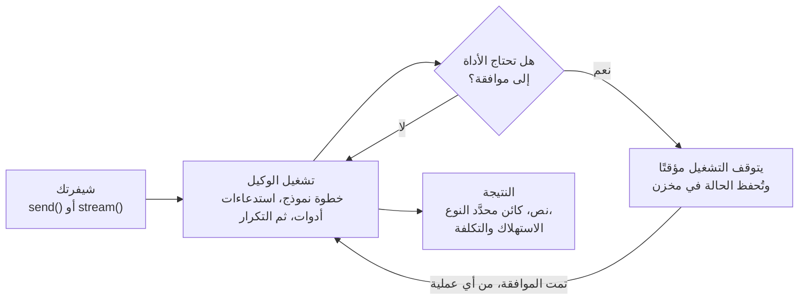

تبدأ معظم شيفرات الوكلاء حلقةً تدور حول استدعاء نموذج، ثم تأتي بيئة الإنتاج بمطالب أخرى: لا بدّ أن يوافق إنسان على استرداد المبلغ قبل إرساله، والعملية يُعاد تشغيلها والوكيل في منتصف عمله، والمحادثة يجب أن تُستكمل غدًا من خادم آخر، وهناك من يريد اختبارًا يفشل حين يتوقف الوكيل عن استدعاء الأداة الصحيحة.

`@lousho/build-ai-agent` هي تلك الحلقة وقد بُنيت فيها هذه الإجابات. إنها مكتبة، بلا إطار ويب وبلا بيئة تشغيل مستضافة: حلقة استدعاء أدوات محدَّدة الأنواع، معها الموافقات والجلسات والبث والوكلاء الفرعيون والمهارات و MCP وواجهة سطر أوامر (CLI). والوكيل نفسه يعمل في سكربت، أو خادم Node، أو حاوية Docker، أو Cloudflare Worker.



```ts
import { createAgent } from '@lousho/build-ai-agent';

const agent = createAgent({ model: 'openai/gpt-4o-mini', instructions: 'You are a helpful assistant.' });
const { text } = await agent.send('Hello!');
console.log(text);
```

## ما الذي يميّزها

<CardGroup cols={3}>
  <Card title="متينة على أي بيئة استضافة" icon="database" href="/ar/durable-execution">
    تُحفظ الجلسات ونقاط الحفظ وتوقفات انتظار الموافقة في مخازن قابلة للتبديل: الذاكرة، أو الملفات، أو ملف SQLite واحد، أو Cloudflare KV. والتشغيل المتوقف مؤقتًا أو المنقطع يُستأنف من طلب آخر أو من عملية أخرى.
  </Card>
  <Card title="تُختبر كما تُختبر الشيفرة" icon="flask-conical" href="/ar/testing">
    `mockModel` يكتب للنموذج ردوده سلفًا، وأشرطة التسجيل في `recordReplay` تعيد تشغيلات حقيقية دون اتصال، و`defineEval()` يتحقق من الأدوات التي استُدعيت، وبأي ترتيب، وبأي معاملات.
  </Card>
  <Card title="Node و Workers، مع التتبّع" icon="activity" href="/ar/deployment">
    `lousho build` ينشر ملف مواصفات واحدًا للوكيل على خادم Node أو Docker أو Worker. تُصدر التشغيلات مقاطع تتبّع (spans) وفق OpenTelemetry GenAI، وكل نتيجة تتضمن استهلاك الرموز (tokens) والتكلفة بالدولار الأمريكي.
  </Card>
</CardGroup>

## اللبنات الأساسية

كل لبنة هي دالة واحدة أو خيار واحد في `createAgent()`. استخدم ما تحتاج إليه منها؛ فلا تتوقف أي لبنة على غيرها.

| اللبنة | ما تكتبه | ما تحصل عليه |
| ----- | -------------- | ------------ |
| [الأدوات](/ar/tools) | `defineTool()` مع `input` من zod | معاملات محدَّدة الأنواع ومُتحقَّق منها، واستدعاءات تُنفَّذ بالتوازي |
| [الموافقات](/ar/approvals) | `needsApproval`، أو قواعد `permissions` | تشغيل يتوقف مؤقتًا بانتظار إنسان، ثم يُكمل عبر `agent.approvals.resolve()` |
| [الجلسات](/ar/sessions) | `agent.session({ id })` | محادثة متعددة الدورات تُحفظ في الذاكرة أو الملفات أو SQLite |
| [الذاكرة](/ar/memory) | خانات `defineMemory()` | حقائق تُستحضر إلى الموجّه عبر الجلسات، لكل مستخدم أو على المستوى العام |
| [المخرجات المنظَّمة](/ar/structured-output) | `output: zodSchema` | `result.object` محدَّد النوع ومُتحقَّق منه، مع خطوة إصلاح واحدة |
| [البث](/ar/streaming) | `agent.stream()` | أحداث JSON محدَّدة الأنواع وذات إصدارات، جاهزة لـ SSE |
| [الوكلاء الفرعيون](/ar/sub-agents) | `subagents: { researcher, writer }` | أداة `task` واحدة للوكيل الرئيسي؛ ويعمل الوكلاء الفرعيون بالتوازي، محليًا أو عن بُعد |
| [المهارات](/ar/skills) | `loadSkills()` | تعليمات لا يحمّلها الوكيل إلا حين تحتاج إليها المهمة |
| [المزوّدون](/ar/providers) | سلسلة نصية بصيغة `provider/model` | OpenAI أو Anthropic أو OpenRouter أو Ollama أو مزوّد وهمي، مع إعادة المحاولة والبديل الاحتياطي |

## أين يمكن أن يعمل الوكيل

الوكيل هو الكائن نفسه في كل مكان. ما يتغير هو الواجهة التي تقف أمامه.

<CardGroup cols={2}>
  <Card title="في تطبيق ويب" icon="browser" href="/ar/react">
    `useLoushoAgent()` لـ React و Vue، ومخزن (store) لـ Svelte، و`useChat` من Vercel AI SDK، أو `createRouteHandler(agent)` في أي إطار عمل يعتمد Fetch API.
  </Card>
  <Card title="في المحادثات ووفق جدول زمني" icon="message-square" href="/ar/channels">
    قنوات Slack و Discord و webhooks و HTTP العادي تربط الرسائل بالجلسات وتعيد طلبات الموافقة إلى المحادثة. وجداول cron الزمنية تبدأ التشغيلات من تلقاء نفسها.
  </Card>
  <Card title="في محرر" icon="code" href="/ar/acp">
    `lousho acp` يقدّم وكيلك إلى Zed وغيره من المحررات التي تدعم Agent Client Protocol، مع استدعاءات الأدوات وطلبات الصلاحيات.
  </Card>
  <Card title="خدمةً منشورة" icon="rocket" href="/ar/deployment">
    `lousho build` ينتج خادم Node أو صورة Docker أو Cloudflare Worker من ملف مواصفات واحد.
  </Card>
</CardGroup>

## الخطوات التالية

- [البدء السريع](/ar/quickstart): أنشئ هيكل مشروع جاهزًا، أو شغّل الوكيل ذا الأسطر الخمسة. تعمل المقتطفات دون اتصال بفضل المزوّد الوهمي المضمَّن.
- [التثبيت](/ar/installation): المتطلبات، والاعتماديات النظيرة، وأي حزمة مزوّد تتوافق مع أي إصدار رئيسي من `ai`.
- [الأدوات](/ar/tools): عرّف أداتك الأولى وانظر كيف يُتحقَّق من المعاملات.
- [الموافقات](/ar/approvals): أوقف تشغيلًا مؤقتًا بانتظار قرار بشري ثم استأنفه.
- [الاختبار](/ar/testing): اكتب اختبارًا حتميًا لوكيل دون مفتاح API.
- [Lousho مع وكلاء البرمجة](/ar/coding-agents): وجّه Claude Code أو Cursor أو أي وكيل برمجة آخر إلى توثيق يستطيع قراءته.
