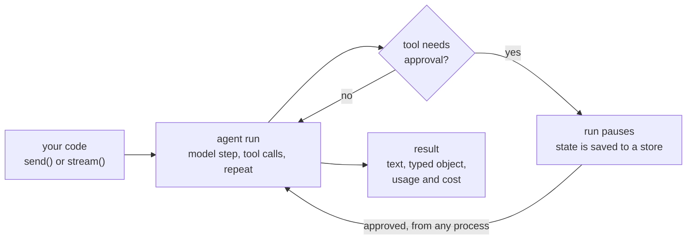

Most agent code starts as a loop around a model call, and then production asks for more: a human has to approve the refund before it is sent, the process restarts halfway through a run, the conversation has to continue tomorrow from another server, and somebody wants a test that fails when the agent stops calling the right tool.

`@lousho/build-ai-agent` is that loop with those answers built in. It is a library, with no web framework and no hosted runtime: a typed tool-calling loop with approvals, sessions, streaming, sub-agents, skills, MCP and a CLI. The same agent runs in a script, a Node server, a Docker container or a Cloudflare Worker.



```ts
import { createAgent } from '@lousho/build-ai-agent';

const agent = createAgent({ model: 'openai/gpt-4o-mini', instructions: 'You are a helpful assistant.' });
const { text } = await agent.send('Hello!');
console.log(text);
```

## What sets it apart

<CardGroup cols={3}>
  <Card title="Durable on any host" icon="database" href="/durable-execution">
    Sessions, checkpoints and approval pauses live in pluggable stores: memory, files, one SQLite file, or Cloudflare KV. A paused or interrupted run resumes from another request or another process.
  </Card>
  <Card title="Tested like code" icon="flask-conical" href="/testing">
    `mockModel` scripts the model, `recordReplay` cassettes replay real runs offline, and `defineEval()` asserts on which tools were called, in what order, with which arguments.
  </Card>
  <Card title="Node and Workers, traced" icon="activity" href="/deployment">
    `lousho build` ships one agent spec to a Node server, Docker or a Worker. Runs emit OpenTelemetry GenAI spans, and every result reports token usage and USD cost.
  </Card>
</CardGroup>

## The building blocks

Each block is one function or one option on `createAgent()`. Use the ones you need; none of them requires the others.

| Block | What you write | What you get |
| ----- | -------------- | ------------ |
| [Tools](/tools) | `defineTool()` with a zod `input` | Arguments typed and validated, calls run in parallel |
| [Approvals](/approvals) | `needsApproval`, or `permissions` rules | A run that pauses for a human, then continues with `agent.approvals.resolve()` |
| [Sessions](/sessions) | `agent.session({ id })` | A multi-turn conversation kept in memory, files or SQLite |
| [Memory](/memory) | `defineMemory()` slots | Facts recalled into the prompt across sessions, per user or globally |
| [Structured output](/structured-output) | `output: zodSchema` | A typed, validated `result.object`, with one repair step |
| [Streaming](/streaming) | `agent.stream()` | Typed, versioned JSON events, ready for SSE |
| [Sub-agents](/sub-agents) | `subagents: { researcher, writer }` | One `task` tool for the lead; sub-agents run in parallel, locally or remotely |
| [Skills](/skills) | `loadSkills()` | Instructions the agent loads only when a task needs them |
| [Providers](/providers) | a `provider/model` string | OpenAI, Anthropic, OpenRouter, Ollama or a mock, with retry and fallback |

## Where an agent can live

The agent is the same object everywhere. What changes is the surface in front of it.

<CardGroup cols={2}>
  <Card title="In a web app" icon="browser" href="/react">
    `useLoushoAgent()` for React and Vue, a store for Svelte, the Vercel AI SDK's `useChat`, or `createRouteHandler(agent)` in any Fetch-API framework.
  </Card>
  <Card title="In chat and on a schedule" icon="message-square" href="/channels">
    Slack, Discord, webhooks and plain HTTP channels map messages to sessions and send approvals back. Cron schedules start runs on their own.
  </Card>
  <Card title="In an editor" icon="code" href="/acp">
    `lousho acp` serves your agent to Zed and other Agent Client Protocol editors, with tool calls and permission prompts.
  </Card>
  <Card title="As a deployed service" icon="rocket" href="/deployment">
    `lousho build` produces a Node server, a Docker image or a Cloudflare Worker from one spec.
  </Card>
</CardGroup>

## Next steps

- [Quick start](/quickstart): scaffold a project, or run the five-line agent. The snippets run offline with the built-in mock provider.
- [Installation](/installation): requirements, peer dependencies, and which provider package pairs with which `ai` major.
- [Tools](/tools): define your first tool and see how arguments are validated.
- [Approvals](/approvals): pause a run for a human decision and resume it.
- [Testing](/testing): write a deterministic test for an agent without an API key.
- [Lousho with coding agents](/coding-agents): point Claude Code, Cursor or another coding agent at docs it can read.
